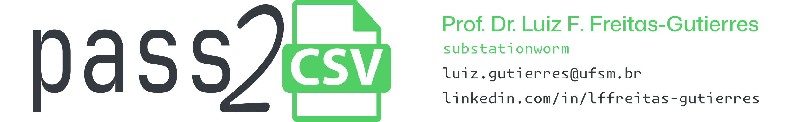

# pass2csv



[](http://lattes.cnpq.br/8846358506427099)
[](https://orcid.org/0000-0002-6254-7306)
[](https://sciprofiles.com/profile/lffreitas-gutierres)
[](https://www.scopus.com/authid/detail.uri?authorId=57195542368)
[](https://www.webofscience.com/wos/author/record/Q-8444-2016)
[](https://github.com/substationworm)

## Introduction

`pass2csv` is a command-line interface (CLI) tool designed to export passwords from `pass` ([the standard Unix password manager](https://www.passwordstore.org/)) into a CSV format compatible with the [KeePass](https://keepass.info/) import functionality.

## Basic Usage

`pass2csv` relies on `pass` for its operation (❗). Follow the steps below to execute the script:

1. Download the script from the GitHub repository:
```bash
git clone https://github.com/substationworm/pass2csv.git
cd pass2csv
```

2. Grant execution permissions to the script using the following command:
```bash
chmod +x pass2csv.sh
```

3. Run the script in the terminal:
```bash
./pass2csv.sh
```

The `pass2csv` tool offers command-line options to customize its behavior:
- `-h`: Displays a help message detailing the available options and usage.
- `-o <file>`: Specifies the output file name. If not specified, the default output file is `passwordsCSV.csv`.
- `-f <fields>`: Excludes specific fields from the generated CSV file. The following fields are available for exclusion:
    - Title.
    - User.
    - Password.
    - URL.
    - Notes.
- `-d <directory>`: Specifies the directory containing the `.password-store`. The default directory is `~/.password-store`.

---

*Corresponding author:* [Prof. Dr. Luiz F. Freitas-Gutierres](https://www.linkedin.com/in/lffreitas-gutierres/) ([luiz.gutierres@ufsm.br](mailto:luiz.gutierres@ufsm.br)).

*License:* [MIT](https://github.com/substationworm/pass2csv/blob/main/LICENSE).


